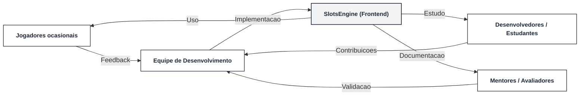

# Introducao

SlotsEngine e um aplicativo mobile de slot machine criado em React Native com Expo. O projeto simula o ciclo completo de um jogo casual de caca-niqueis (deposito, aposta, giro, calculo de ganhos e saque ficticio), mantendo todo o estado no cliente e expondo a logica de sorteio e pagamento de forma transparente.

# Problema

Jogos de slots costumam depender de backends ou servicos proprietarios para controlar regras, pagamentos e feedback. Para fins de estudo e portfolio, o objetivo aqui e mostrar esse fluxo de ponta a ponta apenas no front-end, garantindo:
- clareza sobre creditos e apostas sem envolver dinheiro real;
- feedback instantaneo sobre vitorias/erros em uma grade compacta (3x3);
- alternancia de tema e sons para reforcar a experiencia audiovisual mesmo sem infraestrutura externa.

# Objetivos

**Objetivo geral:** entregar um prototipo funcional de slots, autosuficiente no cliente, com regras de premiacao configuraveis e UX clara.

**Objetivos especificos:**
- Validar a interacao principal (deposito -> aposta -> giro -> saque) em tela pequena, com mensagens curtas e status visivel.
- Implementar regras de raridade e pagamentos por linhas/diagonais, permitindo ajustes rapidos de balanceamento.
- Disponibilizar controles imediatos: ligar/desligar sons, alternar tema claro/escuro e mascarar entradas monetarias.
- Documentar arquitetura e fluxo para facilitar reuso didatico ou evolucao futura.

# Justificativa

O projeto funciona como laboratorio de UX e logica de jogos casuais sem dependencias de backend. Ele permite demonstrar:
- como estruturar estados criticos (saldo, aposta, resultados) em um unico hook;
- como comunicar erros comuns (saldo insuficiente, deposito abaixo do minimo, saque maior que o saldo, falta de chave PIX) de forma consistente;
- como aplicar pesos de raridade e pagamentos graduais em uma grade pequena preservando legibilidade.

Benchmarks utilizados: inspecao de apps de slots populares, conversas rapidas com jogadores ocasionais e sessoes exploratorias no Expo Go.

# Publico-alvo

- **Jogadores ocasionais** que querem entender rapidamente saldo, aposta e resultado sem tutoriais longos.
- **Estudantes/desenvolvedores** interessados em examinar logica de sorteio, pagamentos e controle de estado em React Native.
- **Stakeholders academicos/mentores** que avaliam clareza da documentacao e ausencia de transacoes reais.

## Perfis
- **Marina (24, designer junior)**: testa UX de jogos casuais, valoriza clareza visual e feedback imediato.
- **Carlos (29, dev mobile)**: busca exemplos de hooks e mascaras de input simples para jogos 2D.
- **Gerente/mentor**: precisa validar que nao ha transacoes reais e que o fluxo esta bem documentado.

## Mapa de stakeholders

O entendimento desses perfis guiou mensagens curtas, limites claros de valores e a escolha por nao depender de backend.
