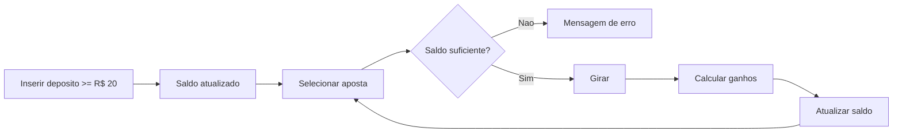
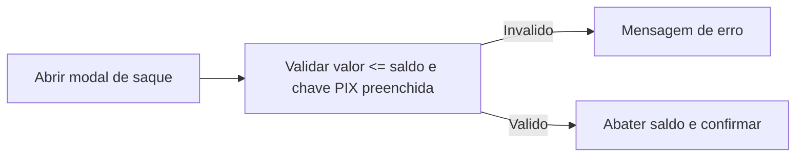
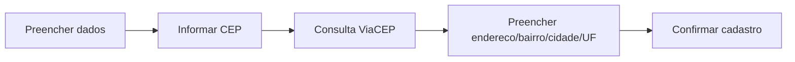

# Especificacao do Projeto

Este documento detalha personas, historias de usuario, requisitos e restricoes do SlotsEngine. A solucao e 100% client-side e foca em demonstrar a logica de um jogo de slots de forma transparente e didatica.

## Personas
- **Marina (Jogadora casual, 24)** - quer testar giros rapidos, entender saldo e mensagens sem ler tutoriais.
- **Carlos (Dev mobile, 29)** - deseja inspecionar o codigo para reutilizar o hook de logica, mascaras de input e componentes.
- **Mentor/avaliador** - precisa confirmar ausencia de transacoes reais e clareza nos limites de aposta/saque.

## Historias de Usuario

| EU COMO... | QUERO/PRECISO... | PARA... |
| --- | --- | --- |
| Jogador casual | Depositar um valor e liberar as apostas | Comecar a jogar rapidamente |
| Jogador casual | Escolher valores de aposta pre-definidos | Evitar erros digitando numeros invalidos |
| Jogador casual | Ver mensagem clara de vitoria/derrota | Entender o resultado de cada giro |
| Jogador casual | Sacar parte do saldo ficticio com chave PIX | Encerrar a sessao com sensacao de conclusao |
| Jogador casual | Silenciar sons e alternar tema | Jogar em ambientes diferentes sem incomodo |
| Jogador casual | Preencher endereco automaticamente via CEP | Acelerar cadastro em dispositivos moveis |
| Dev/estudante | Consultar regras e pesos de simbolos | Ajustar balanceamento de forma segura |
| Mentor | Garantir que nao ha dinheiro real | Validar o objetivo academico/portfolio |

## Modelagem de Processo

### Fluxo principal (deposito -> aposta -> giro)

### Fluxo de saque

### Fluxo de cadastro

## Indicadores
- **Tempo de resposta do giro**: feedback (mensagem + animacao) em < 1s apos clique.
- **Erros de input**: zero giros permitidos com saldo insuficiente ou deposito abaixo do minimo.
- **Cobertura manual de cenarios criticos**: deposito, giro com vitoria, giro sem saldo, saque invalido, troca de tema/som, mascara de saque, busca de CEP.

## Requisitos

### Requisitos Funcionais
| ID | Descricao | Prioridade | Responsavel |
| --- | --- | --- | --- |
| RF-01 | Permitir deposito minimo de R$ 20 para liberar apostas | Alta | Frontend |
| RF-02 | Validar saldo antes de cada giro e bloquear aposta invalida | Alta | Frontend |
| RF-03 | Sortear simbolos com pesos de raridade e calcular pagamentos por linhas/diagonais | Alta | Frontend |
| RF-04 | Exibir banner de mensagem com resultado (ganho, erro, aviso) | Alta | Frontend |
| RF-05 | Registrar ultima aposta e ultimo premio exibidos em tela | Media | Frontend |
| RF-06 | Simular saque abatendo saldo e exigindo chave PIX | Media | Frontend |
| RF-07 | Permitir ligar/desligar sons e alternar tema claro/escuro | Media | Frontend |
| RF-08 | Mascarar valores monetarios em BRL no saque e mostrar saldo formatado | Media | Frontend |
| RF-09 | Aplicar mascaras de CPF/data/telefone/CEP e preencher endereco via ViaCEP | Media | Frontend |

### Requisitos Nao Funcionais
| ID | Descricao | Prioridade |
| --- | --- | --- |
| RNF-01 | App deve operar offline apos carregado (exceto sons remotos e consulta ViaCEP) | Media |
| RNF-02 | Mensagens devem ser curtas para caber em mobile | Alta |
| RNF-03 | Navegacao deve funcionar em telas pequenas (celular) e modo web do Expo | Media |
| RNF-04 | Codigo organizado em componentes e hooks reutilizaveis | Alta |

## Restricoes
| ID | Restricao |
| --- | --- |
| R-01 | Nao ha transacoes financeiras reais; todos os valores sao ficticios |
| R-02 | Projeto deve ser executavel via Expo sem backend |
| R-03 | Sons dependem de URLs externas; offline os audios nao tocam |
| R-04 | Consulta de CEP depende de rede e pode falhar silenciosamente |

## Matriz de Rastreabilidade (resumo)

| Item | RF-01 | RF-02 | RF-03 | RF-04 | RF-05 | RF-06 | RF-07 | RF-08 | RF-09 |
| --- | --- | --- | --- | --- | --- | --- | --- | --- | --- |
| Deposito minimo | X |  |  |  |  |  |  |  |  |
| Giro validado |  | X | X | X | X |  |  |  |  |
| Mensagens |  |  |  | X | X |  |  |  |  |
| Saque |  |  |  |  |  | X |  | X |  |
| Tema/Som |  |  |  |  |  |  | X |  |  |
| Mascaras |  |  |  |  |  |  |  | X | X |
| ViaCEP |  |  |  |  |  |  |  |  | X |

## Gerenciamento de Projeto (resumo)
- **Ferramentas**: GitHub para versionamento, Expo Go para testes manuais, quadros simples (Trello/Issues) para tarefas.
- **Riscos chave**: dependencia de internet para sons e ViaCEP, ajustes de balanceamento (pesos e pagamentos) afetando percepcao de fairness.
