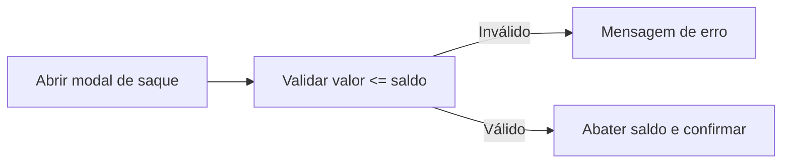

# Especificação do Projeto

Este documento detalha personas, histórias de usuário, requisitos e restrições do SlotsEngine. A solução é 100% client-side e foca em demonstrar a lógica de um jogo de slots de forma transparente e didática.

## Personas
- **Marina (Jogadora casual, 24)** – quer testar giros rápidos, entender saldo e mensagens sem ler tutoriais.
- **Carlos (Dev mobile, 29)** – deseja inspecionar o código para reutilizar o hook de lógica e os componentes.
- **Mentor/avaliador** – precisa confirmar ausência de transações reais e clareza nos limites de aposta/saque.

## Histórias de Usuário

| EU COMO... | QUERO/PRECISO... | PARA... |
| --- | --- | --- |
| Jogador casual | Depositar um valor e liberar as apostas | Começar a jogar rapidamente |
| Jogador casual | Escolher valores de aposta pré-definidos | Evitar erros digitando números inválidos |
| Jogador casual | Ver mensagem clara de vitória/derrota | Entender o resultado de cada giro |
| Jogador casual | Sacar parte do saldo fictício | Encerrar a sessão com sensação de conclusão |
| Jogador casual | Silenciar sons e alternar tema | Jogar em ambientes diferentes sem incômodo |
| Dev/estudante | Consultar regras e pesos de símbolos | Ajustar balanceamento de forma segura |
| Mentor | Garantir que não há dinheiro real | Validar o objetivo acadêmico/portfólio |

## Modelagem de Processo

### Fluxo principal (depósito → aposta → giro)
```mermaid
flowchart LR
    A[Inserir depósito >= R$20] --> B[Saldo atualizado]
    B --> C[Selecionar aposta]
    C --> D{Saldo suficiente?}
    D -- Não --> M[Mensagem de erro]
    D -- Sim --> E[Girar roleta]
    E --> F[Calcular ganhos (linhas/diagonais)]
    F --> G[Atualizar saldo e mensagem]
```

### Fluxo de saque


## Indicadores
- **Tempo de resposta do giro**: manter feedback (mensagem + animação) em < 1s após clique.
- **Erros de input**: zero giros permitidos com saldo insuficiente ou depósito abaixo do mínimo.
- **Cobertura manual de cenários críticos**: depósito, giro com vitória, giro sem saldo, saque inválido, troca de tema/som.

## Requisitos

### Requisitos Funcionais
| ID | Descrição | Prioridade | Responsável |
| --- | --- | --- | --- |
| RF-01 | Permitir depósito mínimo de R$ 20 para liberar apostas | Alta | Frontend |
| RF-02 | Validar saldo antes de cada giro e bloquear aposta inválida | Alta | Frontend |
| RF-03 | Sortear símbolos com pesos de raridade e calcular pagamentos por linhas/diagonais | Alta | Frontend |
| RF-04 | Exibir banner de mensagem com resultado (ganho, erro, aviso) | Alta | Frontend |
| RF-05 | Registrar última aposta e último prêmio exibidos em tela | Média | Frontend |
| RF-06 | Simular saque abatendo o saldo disponível | Média | Frontend |
| RF-07 | Permitir ligar/desligar sons e alternar tema claro/escuro | Média | Frontend |

### Requisitos Não Funcionais
| ID | Descrição | Prioridade |
| --- | --- | --- |
| RNF-01 | App deve operar offline após carregado (exceto sons remotos) | Média |
| RNF-02 | Mensagens devem ser concisas (máx. ~120 caracteres) para caber em mobile | Alta |
| RNF-03 | Navegação deve funcionar em telas pequenas (celular) e modo web do Expo | Média |
| RNF-04 | Código organizado em componentes e hooks reutilizáveis | Alta |

## Restrições
| ID | Restrição |
| --- | --- |
| R-01 | Não há transações financeiras reais; todos os valores são fictícios |
| R-02 | Projeto deve ser executável via Expo sem backend |
| R-03 | Sons dependem de URLs externas; offline, os áudios não tocam |

## Matriz de Rastreabilidade (resumo)

| Item | RF-01 | RF-02 | RF-03 | RF-04 | RF-05 | RF-06 | RF-07 |
| --- | --- | --- | --- | --- | --- | --- | --- |
| Depósito mínimo | X |  |  |  |  |  |  |
| Giro validado |  | X | X | X | X |  |  |
| Mensagens |  |  |  | X | X |  |  |
| Saque |  |  |  |  |  | X |  |
| Tema/Som |  |  |  |  |  |  | X |

## Gerenciamento de Projeto (resumo)
- **Ferramentas**: GitHub para versionamento, Expo Go para testes manuais, Quadros simples (Trello/Issues) para tarefas.
- **Riscos chave**: dependência de internet para sons, ajustes de balanceamento (pesos e pagamentos) afetando percepção de fairness.
