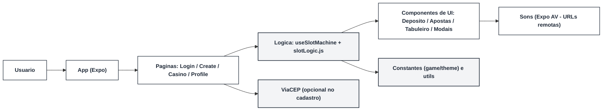

# Arquitetura da Solucao

SlotsEngine e um aplicativo 100% client-side em React Native com Expo. Toda a logica de sorteio, calculo de pagamento e gerenciamento de saldo roda localmente. Login e cadastro sao telas de entrada sem integracao externa; o cassino fica em CasinoPage usando o hook central; ProfilePage apenas exibe dados em memoria. A unica chamada remota opcional e ViaCEP no cadastro e as URLs de audio para os sons.

## Visao geral



- **Pages**: `src/pages` contem `LoginPage`, `CreateAccountPage`, `CasinoPage` (cassino principal) e `ProfilePage` (dados do usuario).
- **UI**: componentes em `src/components` organizam secoes (header, deposito, apostas, tabuleiro, estatisticas, modais).
- **Logica**: `src/hooks/useSlotMachine.js` controla saldo, apostas, mensagens e modais; `src/game/slotLogic.js` gera a grade 3x3, aplica pesos de raridade e calcula pagamentos.
- **Constantes**: regras de jogo e URIs de som em `src/constants/game.js`; temas em `src/constants/theme.js`.
- **Utilitarios**: formatacao monetaria e transformacao de grid em `src/utils`.
- **Integracoes**: ViaCEP consultado em `CreateAccountPage` para preencher endereco; audios carregados de URLs publicas.

## Modelagem de dados (client-side)
- **Saldo**: numero inteiro em centavos controlado pelo hook.
- **Aposta**: valor selecionado a partir de `apostasDisponiveis`.
- **Grid**: matriz 3x3 de simbolos; posicoes vencedoras marcadas para destacar na UI.
- **Mensagens**: texto + flag de erro exibidos no banner.
- **Usuario**: dados basicos em memoria (nome/email/telefone) usados no ProfilePage.
- **Forma de saque**: valor mascarado em BRL e chave PIX digitada.

## Regras de negocio principais
- Deposito minimo de R$ 20 para habilitar giros.
- Debito do saldo antes do giro; credito de ganhos apos calculo.
- Pagamentos por tres simbolos iguais na mesma linha e bonus para linhas/diagonais completas.
- Pesos de raridade definem a probabilidade de cada simbolo no sorteio.
- Saque simulado subtrai do saldo e exige chave PIX.

## Estrutura de pastas do app
```
SlotsEngine/frontend/
  App.js                # roteia LoginPage, CreateAccountPage, CasinoPage e ProfilePage
  src/pages/            # telas (login/cadastro/cassino/perfil)
  src/components/       # UI (DepositSection, BetSelector, SlotBoard, SettingsModal, etc.)
  src/constants/        # game.js, theme.js
  src/game/             # slotLogic.js (sorteio/pagamentos)
  src/hooks/            # useSlotMachine, useSounds
  src/styles/           # estilos globais
  src/utils/            # formatadores e helpers de grid
```

## Tecnologias
- **Frontend**: React Native 0.81 + Expo 54.
- **Audio**: Expo AV usando URLs externas.
- **Dados auxiliares**: consulta ViaCEP para preencher endereco no cadastro.
- **Deploy/execucao**: Expo Go (Android/iOS/web). Sem servicos de backend.

## Hospedagem e distribuicao
- Execucao via Expo (CLI + QR Code).
- Nao ha publicacao em lojas; para build standalone usar `eas build` futuramente, se necessario.

## Qualidade e manutenibilidade
- Estado centralizado em um hook, facilitando testes isolados da logica.
- Regras configuraveis em arquivos de constantes e logica, permitindo ajustes de balanceamento sem refatorar UI.
- Estrutura modular de componentes favorece substituicao futura (ex.: novos layouts de tabuleiro).
- Mascara de saque e validacoes encapsuladas no hook reduzem dependencia da camada de apresentacao.
